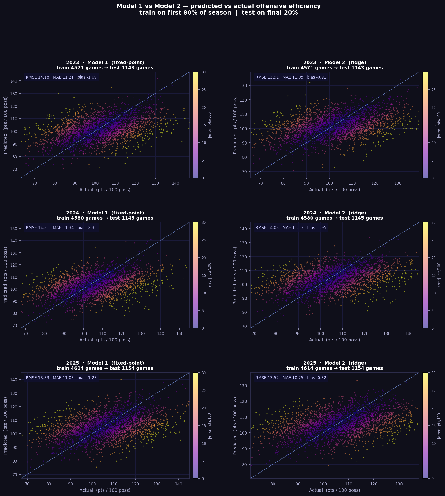
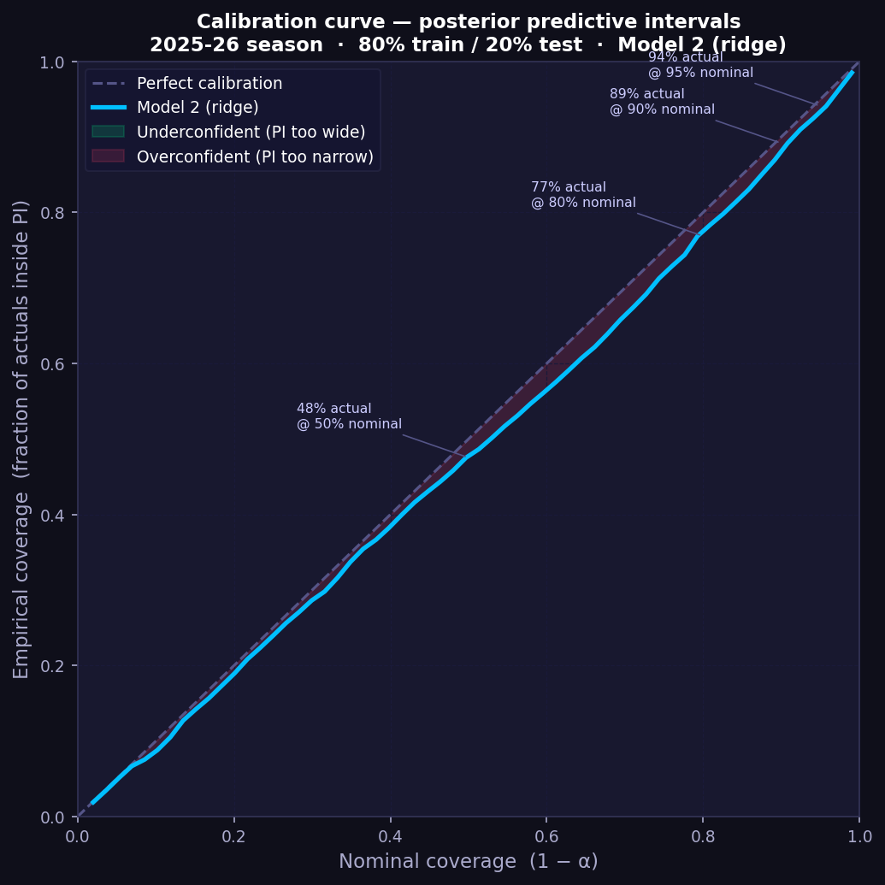
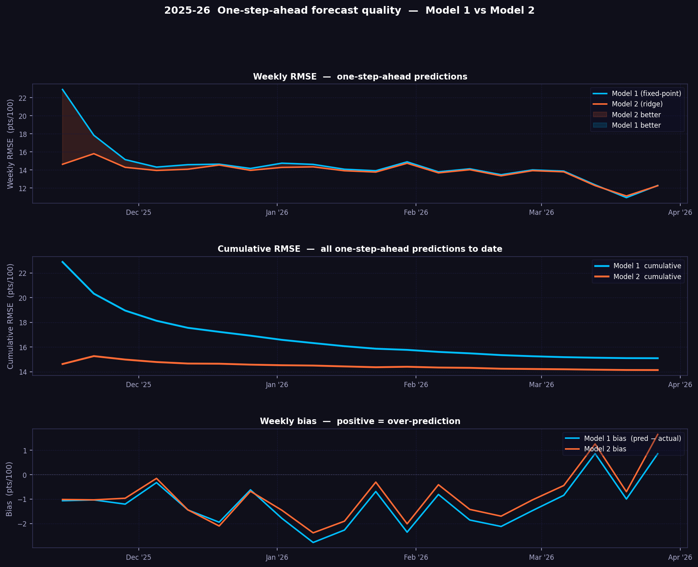
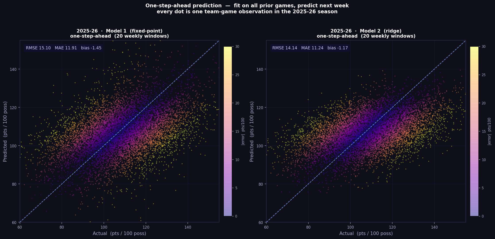
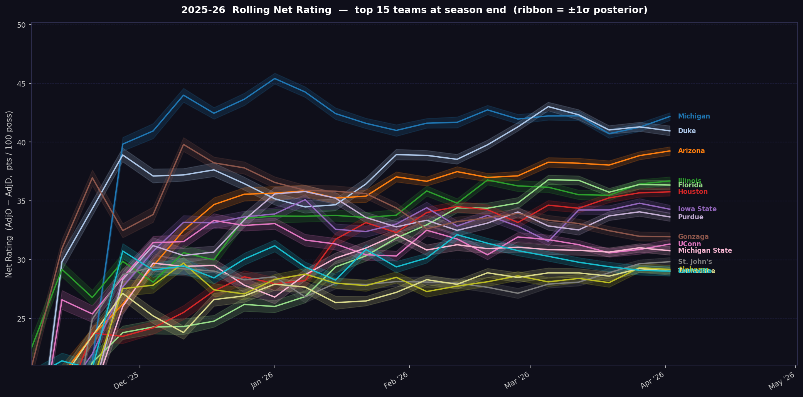
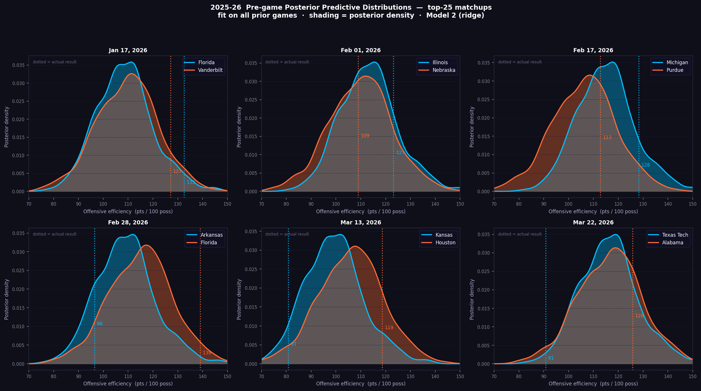
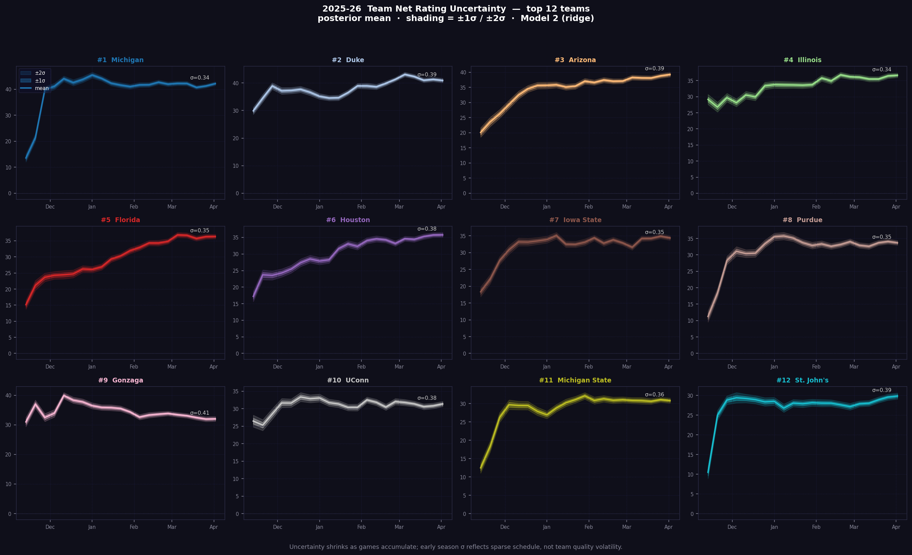

# Statistical KenPom

A Python project for building and evaluating college basketball rating models inspired by KenPom-style efficiency frameworks.

> End-to-end NCAA basketball analytics pipeline: scrape data, estimate team-strength models, and visualize predictive performance.

## At a glance

- **Scope:** KenPom-style offensive/defensive efficiency modeling for college basketball
- **Pipeline:** Team + schedule + boxscore scraping in `ncaa_scraper/`
- **Models:** Three progressively richer model families in `models/`
- **Evaluation:** Predictive validation and diagnostics in `tests/` and `scripts/`
- **Outputs:** Versioned figures for calibration, rolling error, and uncertainty bands

## What this repo contains

- Data scraping and ingestion pipeline in `ncaa_scraper/`
- Multiple model implementations in `models/`
- Validation/evaluation workflows in `tests/` and model evaluation scripts
- Method and model documentation in `docs/`

## Visualization outputs

These generated graphics are tracked in this repository and rendered below.

### Model comparison and calibration




### One-step-ahead diagnostics




### Rating and uncertainty views





## Quick start

```bash
python -m venv .venv
source .venv/bin/activate
pip install -e .
```

## Reproduce figures

Run from the repository root:

```bash
python scripts/scatter_model_comparison.py
python scripts/rolling_one_step_ahead.py
python scripts/rolling_net_rtg_2026.py
python scripts/uncertainty_viz.py
```

This regenerates the tracked plots in `scripts/`, including:

- `scatter_model1_vs_model2.png`
- `rolling_osa_scatter_2025_26.png`
- `rolling_osa_rmse_2025_26.png`
- `rolling_net_rtg_2025_26.png`
- `calibration_curve_2025_26.png`
- `team_uncertainty_fan_2025_26.png`
- `pregame_distributions_2025_26.png`

## Notes

- If plots are regenerated, re-run the corresponding scripts in `scripts/`.
- Database files and caches are intentionally ignored via `.gitignore`.
